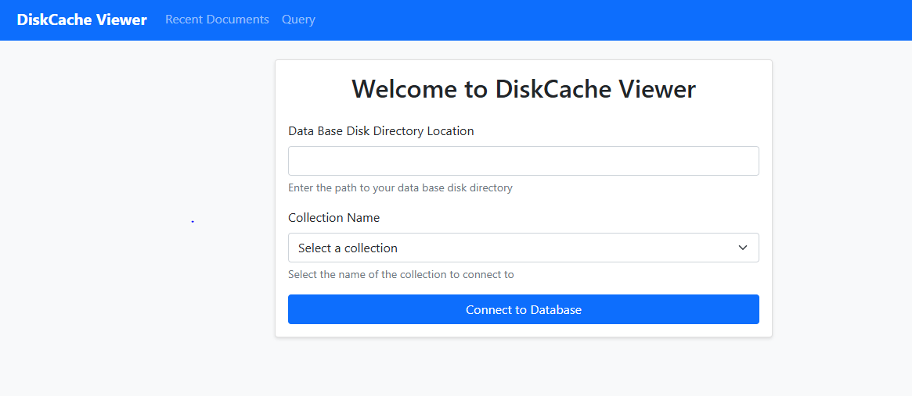
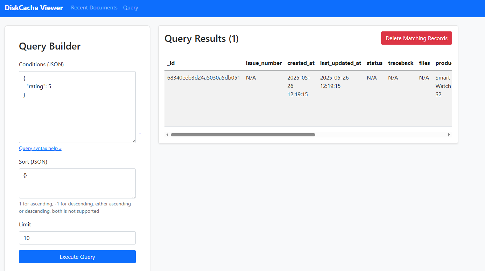
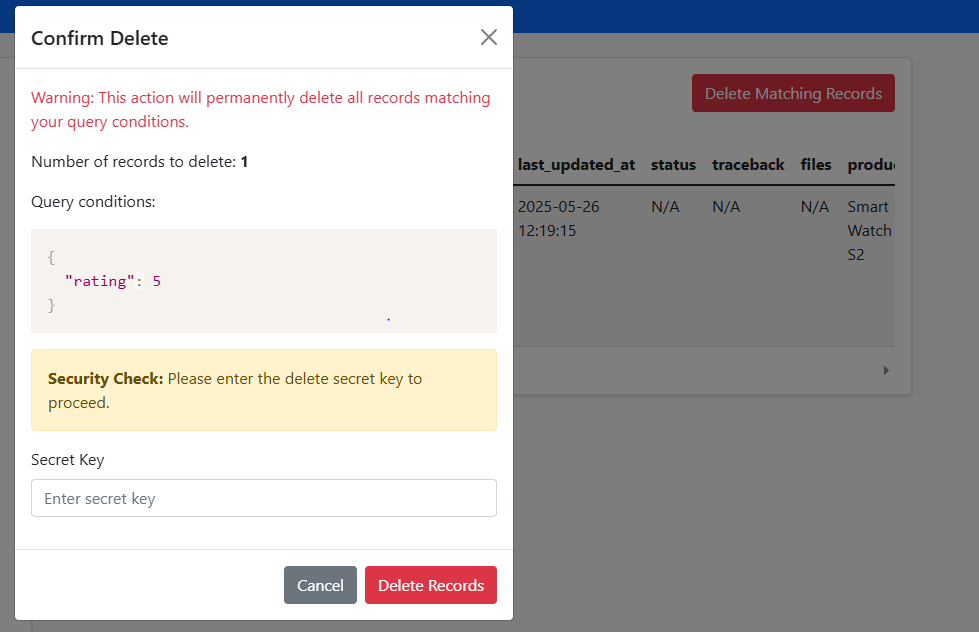

# SimpleDiskDB

A MongoDB-style disk-based database implementation for Python applications. SimpleDiskDB provides a familiar MongoDB-like interface while storing data locally on disk using the `diskcache` package.

## Features

- MongoDB-like document storage and querying
- Thread-safe operations
- Rich query language supporting `$and`, `$or`, `$gt`, `$exists`, `$nin` operators
- Flexible document schema within collections
- Sorting and pagination support
- Projection support to retrieve specific fields
- Data persistence across application restarts

## Installation

```bash
# Install the package
pip install simplediskdb

# Load example data (either method works)
simplediskdb example load
# or
python -m simplediskdb example load

# Delete example data (either method works)
simplediskdb example delete
# or
python -m simplediskdb example delete

# Show available commands
simplediskdb --help
# or
python -m simplediskdb --help
```

## Web Viewer Interface

SimpleDiskDB comes with a built-in web viewer that allows you to browse, query, and manage your database collections through a user-friendly interface.

### Starting the Viewer

```bash
# Start the viewer on default host (127.0.0.1) and port (5000)
python -m simplediskdb viewer

# Start on a specific host and port
python -m simplediskdb viewer --host 0.0.0.0 --port 8000
```

### Features

#### Home Page

- Lists all available collections in your database
- Shows document count for each collection
- Quick links to view or query collections

#### View Documents

- Browse all documents in a collection
- Documents are displayed in a paginated table
- JSON view for better readability
- Copy document content to clipboard

#### Query Interface

- Write and execute MongoDB-style queries
- Support for complex queries using operators ($and, $or, $gt, etc.)
- Query results shown in real-time
- Export query results

#### Delete Documents

- Delete documents matching specific query conditions
- **Important Security Note**: The default delete secret key is `simplediskdb`. For production use, you should change this by setting the `DELETE_SECRET_KEY` environment variable:
  ```bash
  # Windows
  set DELETE_SECRET_KEY=your-secure-key

  # Linux/Mac
  export DELETE_SECRET_KEY=your-secure-key
  ```
- Confirmation required before deletion
- Shows count of matching documents before deletion

## Usage

```python
from simplediskdb import DiskDB

# Get a database instance
db = DiskDB()

# Create collections
tasks = db.add_collection('tasks')
users = db.add_collection('users')

# Insert documents
tasks.insert_one({
    "task_id": "T123",
    "status": "pending",
    "priority": 1,
    "assigned_to": "john",
    "files": ["doc1.pdf", "doc2.txt"]
})

# Bulk insert
users.insert_many([
    {"name": "John", "role": "admin"},
    {"name": "Jane", "role": "user"}
])

# Complex query with AND, OR, and comparison operators
results = tasks.find(
    conditions={
        "$and": [
            {"status": "pending"},
            {"$or": [
                {"priority": {"$gt": 0}},
                {"priority": 0}
            ]},
            {"files": {"$exists": True}}
        ]
    },
    sort=[("priority", -1)],
    limit=10
)

# Print results
for doc in results:
    print(doc)
```

## License

This project is licensed under the MIT License - see the LICENSE file for details.

## Contributing

We love your input! We want to make contributing to SimpleDiskDB as easy and transparent as possible, whether it's:

- Reporting a bug
- Discussing the current state of the code
- Submitting a fix
- Proposing new features
- Becoming a maintainer

### Development Process

1. Fork the repo [https://github.com/anandan-bs/simplediskdb](https://github.com/anandan-bs/simplediskdb)
2. Clone your fork (`git clone https://github.com/anandan-bs/simplediskdb.git`)
3. Create your feature branch (`git checkout -b feature/amazing-feature`)
4. Make your changes
5. Run the tests to ensure nothing is broken
6. Commit your changes (`git commit -m 'Add some amazing feature'`)
7. Push to the branch (`git push origin feature/amazing-feature`)
8. Open a Pull Request

### Pull Request Process

1. Update the README.md with details of changes if needed
2. Update the example data or tests if your changes require it
3. Make sure your code follows the existing style
4. Include comments in your code where necessary

### Any Questions?

Feel free to file an issue on the repository or contact the maintainer:
- GitHub: [@anandan-bs](https://github.com/anandan-bs)
- Email: anandanklnace@gmail.com

### License

By contributing, you agree that your contributions will be licensed under its MIT License.

## Acknowledgments

SimpleDiskDB is built on top of the excellent [diskcache](https://pypi.org/project/diskcache/) package, which provides the core storage functionality. Some key performance highlights from diskcache:

- Faster than other disk-based cache implementations like SQLite and LevelDB
- Sequential operations run at ~300 microseconds
- Bulk operations run at ~100 microseconds per operation
- Performance is stable with database size due to O(1) record operations

For detailed performance benchmarks and comparisons with other storage solutions, please refer to the [diskcache documentation](https://grantjenks.com/docs/diskcache/tutorial.html#performance-comparison).
